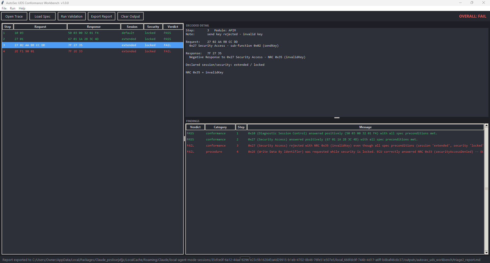

# AutoSec UDS Conformance Workbench

A spec-driven UDS (ISO 14229) validation tool that ingests diagnostic
traces, compares observed ECU behavior against a machine-readable
diagnostic specification, and generates V&V-style findings and triage
notes.

Built for embedded software verification & validation workflows:
integration testing, diagnostic conformance checking, and automotive
cybersecurity triage.



## Why "conformance" and not "decoder"

Decoding UDS bytes is table lookup; plenty of tools do it. The value here
is the **rules engine**: every judgement compares *observed* behavior (the
trace) against *expected* behavior (a JSON diagnostic spec, standing in
for the CDD/ODX artifacts used in production toolchains). Swap the spec
and the same engine validates a different ECU.

## Key design decisions

**Engine/GUI separation.** All diagnostic logic lives in importable,
GUI-free modules (`uds_decoder`, `spec_loader`, `rules_engine`,
`report_writer`). The Tkinter layer (`main.py`) only presents results.
The same engine runs headless in the pytest suite and in CI, and can be
reused in CLI tools or automation pipelines.

**Derived state, not declared state.** The trace CSV carries the tester's
*declared* session/security columns, but the engine derives actual state
from the ECU's own responses (`50 03` = extended session entered,
`67 02` = security unlocked, session changes relock security per
ISO 14229-1). Declared-vs-derived mismatches are reported as
trace-consistency findings — validating against the tester's claim would
be circular.

**Protocol rules, not memorized examples.** Positive response SID is
computed as request SID + 0x40 (the ISO 14229-1 rule), negative responses
are parsed as `7F <SID> <NRC>` with a full NRC table, and the
`suppressPosRspMsgIndicationBit` is masked when decoding sub-functions.

**Security findings are first-class.** A positive response to an
out-of-spec DID or service, or a security-gated service accepted while
locked, is flagged as a `security` finding: undocumented surface =
unreviewed attack surface.

## Verdict semantics

| Verdict | Meaning |
|---|---|
| PASS | Observed behavior conforms to the spec (including *correct rejections*) |
| FAIL | Behavior violates the spec, or the test procedure requested something the spec says cannot succeed |
| BLOCKED | Check not evaluated because an earlier step broke the sequence |
| INFO | Context worth recording; no conformance judgement |

## Project layout

```
autosec_uds_workbench/
├── main.py               # Tkinter GUI (presentation only)
├── cli.py                # headless CLI (same engine, CI-friendly exit codes)
├── uds_decoder.py        # ISO 14229-1 protocol knowledge
├── spec_loader.py        # JSON diagnostic spec parsing/validation
├── rules_engine.py       # spec-driven conformance checks + state tracking
├── report_writer.py      # Markdown triage report generation
├── specs/
│   └── apim_spec.json    # example spec: infotainment ECU (APIM)
├── traces/               # sample traces (each exercises one scenario)
├── reports/              # exported triage notes land here
├── tests/                # pytest suite for the engine (runs in CI)
└── .github/workflows/ci.yml
```

## Quick start

GUI:

```
python main.py
```

1. The bundled APIM spec loads automatically (or **File → Load Spec**).
2. **File → Open Trace** — pick any CSV from `traces/`.
3. **F5 / Run Validation** — verdicts appear per step and per finding.
4. **File → Export Report** — writes the Markdown triage note.

Headless / automation (exit code 0 = PASS/INFO, 1 = FAIL/BLOCKED,
2 = usage error, so a non-conforming trace fails a CI pipeline):

```
python cli.py traces/apim_security_fail_trace.csv --report reports/note.md
echo %ERRORLEVEL%
```

Run the test suite:

```
pytest tests/ -v
```

## Sample traces

| Trace | Demonstrates | Overall |
|---|---|---|
| `apim_pass_trace.csv` | Clean session + reads | PASS |
| `apim_flash_pass_trace.csv` | Full programming sequence in spec order | PASS |
| `apim_did_out_of_range_trace.csv` | Correct `7F 22 31` rejection of unknown DID | PASS |
| `apim_security_fail_trace.csv` | Invalid key, then write blocked by `7F 2E 33` | FAIL |
| `apim_undocumented_did_trace.csv` | Positive response to out-of-spec DID (security finding) | FAIL |
| `apim_flash_sequence_fail_trace.csv` | `0x34` before unlock → sequence FAIL + BLOCKED steps | FAIL |
| `apim_state_mismatch_trace.csv` | Declared vs derived session mismatch | INFO |

## Trace CSV format

```csv
step,module,request,response,session,security_state,note
1,APIM,10 03,50 03,default,locked,enter extended session
```

`session`/`security_state` are the tester's *declared* state; the engine
independently derives actual state from responses and cross-checks.

## Roadmap (deliberately out of scope for v1)

ISO-TP reassembly from raw CAN frames · live capture via python-can ·
DoIP · seed/key analysis · ODX/CDD import · PDF reporting · fuzzing
hooks · ISO 21434 threat-mapping annotations.

## License

MIT
